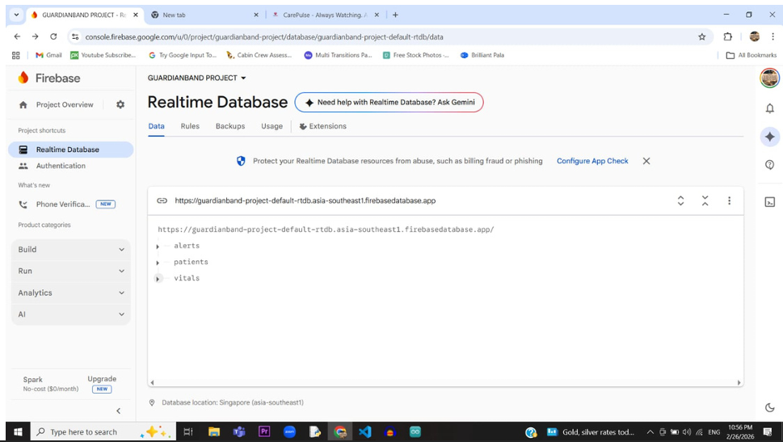
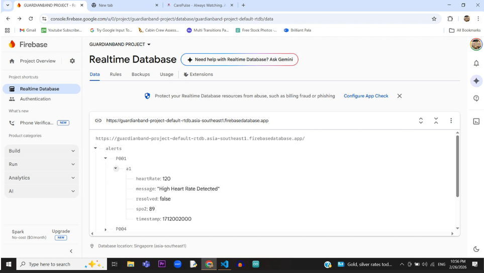
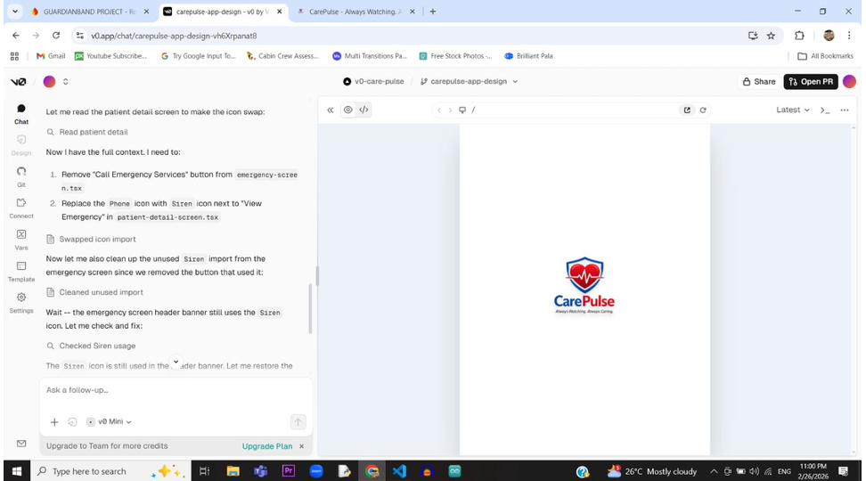
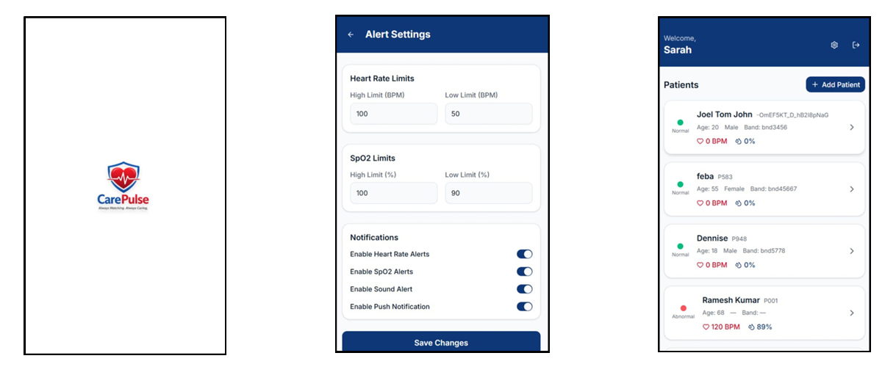
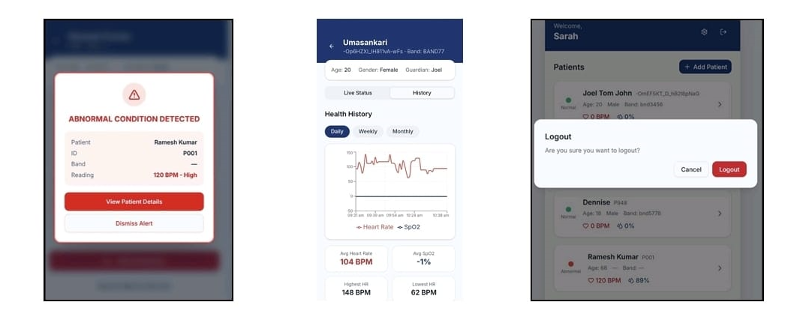

# CarePulse 🏥

### IoT-Based Smart Wearable System for Elderly Health Monitoring and Emergency Alerts

CarePulse is a healthcare and patient-monitoring system designed to support **elderly and bedridden patients** through continuous monitoring of vital signs and real-time emergency alerts.

The system combines an **IoT-based CarePulseBand wearable**, an **ESP32 microcontroller**, a **MAX30102 heart-rate and SpO₂ sensor**, **Firebase Realtime Database**, and the **CarePulse mobile application**.

The wearable collects health data and transmits it through Wi-Fi to Firebase. The mobile application retrieves the data, allows guardians to manage patients and alert thresholds, and displays notifications when abnormal health conditions are detected.

---

## ✨ Features

- ❤️ Continuous heart-rate monitoring
- 🩸 Continuous SpO₂ monitoring
- 📡 Real-time Wi-Fi data transmission
- 🔥 Firebase Realtime Database integration
- 🚨 Abnormal health-condition detection
- 🔔 Emergency alert notifications
- 👤 Patient management
- 📊 Patient health history
- ⚙️ Configurable heart-rate and SpO₂ limits
- 📱 Android mobile application
- 🔋 Battery-powered wearable prototype
- 🔄 Background monitoring and alert handling

---

## 🎯 Problem Statement

Elderly and bedridden patients can be at risk during sudden health emergencies because continuous monitoring and immediate alert mechanisms may not always be available.

CarePulse aims to provide a low-cost wearable monitoring solution that continuously observes important vital signs and informs guardians when abnormal readings are detected.

---

## 💡 Proposed Solution

CarePulseBand is an IoT-based smart wearable wristband integrated with the CarePulse mobile application.

The system follows this basic flow:

```text
MAX30102 Sensor
       │
       ▼
     ESP32
       │
     Wi-Fi
       │
       ▼
Firebase Realtime Database
       │
       ▼
 CarePulse App
       │
       ▼
Emergency Alert
   to Guardian
```

The MAX30102 collects heart-rate and SpO₂ readings. The ESP32 processes the readings and sends the data through Wi-Fi to Firebase. The CarePulse application uses this data for patient monitoring and alert generation.

---

## 🏗️ System Architecture

### Sensing Module
The **MAX30102** sensor is used to measure:

- Heart rate
- SpO₂

### Processing Module
The **ESP32** receives and processes the sensor readings.

### Communication Module
Wi-Fi is used to transmit health data to the Firebase cloud platform.

### Application Module
The CarePulse application provides:

- Patient management
- Live health status
- Health history
- Alert configuration
- Emergency notifications

### Power Module
The wearable prototype uses:

- 3.7V LiPo battery
- TP4056 charging module

---

## 🔄 System Workflow

```text
          START
            │
            ▼
 Read Heart Rate & SpO₂
            │
            ▼
      Check Thresholds
            │
       ┌────┴────┐
       │         │
    Normal    Abnormal
       │         │
       ▼         ▼
 Upload Data  Send Alert
       │         │
       └────┬────┘
            │
            ▼
    Upload to Firebase
            │
            ▼
          Repeat
```

---

# 🛠️ Tech Stack

## Frontend / Application

- Next.js
- React
- TypeScript
- Tailwind CSS
- shadcn/ui
- HTML5
- CSS3

## Backend / Cloud

- Firebase Authentication
- Firebase Realtime Database
- JavaScript
- Firebase / Cloud Functions

## Mobile

- Capacitor
- Android
- Android Studio

## Embedded System

- ESP32
- Embedded C
- Arduino IDE
- SparkFun MAX30102 Library

## Development Tools

- Visual Studio Code
- Git
- GitHub
- Node.js
- npm / pnpm
- Vercel

---

# 🔧 Hardware Components

| Component | Purpose |
|---|---|
| ESP32 | Sensor processing and Wi-Fi communication |
| MAX30102 | Heart-rate and SpO₂ measurement |
| 3.7V LiPo Battery | Power supply |
| TP4056 Charging Module | Battery charging |

---

# 📱 Application

The CarePulse application provides a guardian-facing interface for managing and monitoring patients.

### Patient Management

Guardians can view registered patients along with their monitoring information.

### Alert Settings

The application allows configurable limits for:

- High heart rate
- Low heart rate
- High SpO₂
- Low SpO₂

Notification options include:

- Heart-rate alerts
- SpO₂ alerts
- Sound alerts
- Push notifications

### Abnormal Condition Alert

When an abnormal reading is detected, the application displays an alert containing the patient information and abnormal reading.

### Health History

Patient health information can be viewed using:

- Daily
- Weekly
- Monthly

history views.

---

# ☁️ Firebase Realtime Database

Firebase Realtime Database is used to store and synchronize application data.

The implemented database contains major sections such as:

```text
alerts
patients
vitals
```

Example alert information includes:

```text
heartRate
message
resolved
spo2
timestamp
```

The screenshots below show the Firebase Realtime Database implementation and stored alert information.

---

# 🖼️ Implementation & Results

## Firebase Realtime Database



The Firebase database contains the application's main data sections, including alerts, patients and vitals.

## Firebase Alert Data



An example alert record containing heart-rate, SpO₂, message, resolution status and timestamp information.

## Application Implementation



Application implementation and development interface.

---

# 📊 Final Application Results

## Alert Settings & Patient Dashboard



The application provides configurable alert thresholds and a patient dashboard showing patient status and vital readings.

## Abnormal Alert, Health History & Logout



The final application includes abnormal-condition alerts, health-history views and logout confirmation.

---

# 📁 Project Structure

```text
CarePulse/
│
├── android/                    # Android / Capacitor project
│
├── app/                        # Next.js application
│
├── components/                 # Reusable React components
│   ├── screens/                # Application screens
│   └── ui/                     # UI components
│
├── hooks/                      # Custom React hooks
│
├── lib/                        # Firebase and utility logic
│   ├── firebase.js             # Firebase configuration
│   ├── local-alerts.ts         # Local alert functionality
│   ├── push-notifications.ts   # Push notification functionality
│   ├── store.ts                # Application state
│   └── types.ts                # Type definitions
│
├── public/                     # Images and static assets
│
├── styles/                     # Global styles
│
├── screenshots/                # Project implementation/result screenshots
│
├── capacitor.config.ts         # Capacitor configuration
├── next.config.mjs             # Next.js configuration
├── package.json                # Project dependencies and scripts
└── tsconfig.json               # TypeScript configuration
```

---

# 🚀 Getting Started

## Prerequisites

Install the following before running the project:

- Node.js
- npm or pnpm
- Visual Studio Code
- Android Studio
- Arduino IDE
- ESP32 board support for Arduino IDE
- Firebase project

## Clone the Repository

```bash
git clone <repository-url>
cd CarePulse
```

## Install Dependencies

Using npm:

```bash
npm install
```

or using pnpm:

```bash
pnpm install
```

## Run the Development Server

```bash
npm run dev
```

The application can then be accessed through the local development URL provided by Next.js.

---

# 🔥 Firebase Configuration

Create/configure a Firebase project with the required services and connect the application to the Firebase Realtime Database.

Add the required Firebase configuration to the project configuration.

> **Security:** Do not commit private credentials, service-account keys, passwords, or other sensitive Firebase configuration to the repository.

---

# 📱 Android Application

The project includes an Android application through Capacitor.

The Android project can be opened using **Android Studio** after configuring the required Capacitor and Android dependencies.

---

# 🚧 Challenges Faced

### Wi-Fi Connectivity

During testing, occasional ESP32 Wi-Fi connection drops affected real-time transmission of data to Firebase.

### Firebase Integration

Network instability and ESP32 connection interruptions affected real-time communication with Firebase during testing.

---

# 🔮 Future Scope

Possible future improvements include:

### 🚶 Fall Detection

An accelerometer can be added to detect patient falls and automatically trigger emergency alerts.

### 🩺 Blood Pressure Monitoring

Future versions can explore non-invasive blood-pressure monitoring.

### 🩸 Diabetes Monitoring

Continuous glucose monitoring can be explored to provide additional health information for high-risk and bedridden patients.

---

# 👥 Team Members

| Team Member | Register No. | Role |
|---|---|---|
| **Feba Emily Sajan** | PRC23CS047 | Frontend Developer |
| **Joel Tom John** | PRC23CS059 | Backend Developer |
| **Umasankari T J** | PRC23CS086 | Hardware & Documentation |

### Feba Emily Sajan — Frontend

- User interface development
- Application screens
- Dashboard implementation
- Patient management interface
- Alert settings
- Responsive UI components

### Joel Tom John — Backend

- Firebase integration
- Firebase Authentication
- Firebase Realtime Database
- Application data management
- Backend logic
- Alert and notification data handling

### Umasankari T J — Hardware & Documentation

- Hardware integration
- Hardware-related functionality
- Testing and validation
- Technical documentation
- Project presentation and reporting

**Supervisor:** Prof. Dennise Mathew, Assistant Professor, Department of Computer Science and Engineering.

---

# 📌 Project Information

**Project:** CarePulseBand  
**Type:** CSD 334 Mini Project  
**Domain:** IoT / Healthcare / Mobile Application  
**Institution:** Providence College of Engineering  
**Department:** Computer Science and Engineering

---

## ⭐ Conclusion

CarePulseBand demonstrates an IoT-based approach to continuous elderly and bedridden-patient health monitoring. By combining the **MAX30102 sensor, ESP32, Wi-Fi, Firebase Realtime Database and CarePulse mobile application**, the system provides real-time vital monitoring and abnormal-condition alerts.

The project demonstrates the integration of **embedded systems, cloud services and mobile application development** into a healthcare-focused monitoring solution.
